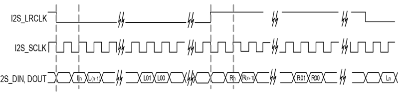

# Final Project  
<style>
<link rel="stylesheet" href="https://fonts.googleapis.com/css?family=Alice">

p, ul,li {
  font-family: 'Alice', serif;
}

</style>

Slides

https://www.icloud.com/keynote/035IBM-K2cGiC3KwusnviqjMg#Presentation

---
Thanks to 

https://opengameart.org/content/tank-sprite

https://opengameart.org/content/98-pixel-art-rpg-icons

https://opengameart.org/content/animated-coins

https://opengameart.org/content/32x32-stone-brick-sprite

https://opengameart.org/content/stone-tiles-0

---
## Stages
Stages are in keynotes. 

We wrote stages document to 
* organize our thoughts 
* core ideas of our design.

---
## Bullet : holes and array

For bullet we can support up to `bullet_num`'s elements in `bullet_array`. 

* An element in `bullet_array` holds basic information about the bullet. 

```sv
bullet_array[i][hole_ind[i]] <= (1'b1 | (turret_direction[i][6:4] << 1) | 
((tank_x[i] + (tank_width >> 1)) << 9)  | 
((tank_y[i] + (tank_height >> 1)) << 19));
```
* This is initialization of the element if bullets start appearting on screen.
---
## Bullet : holes and array

* A hole is just an element that doesn't exist. 
* It's a bullet that's not shot by any tanks.
* They are candidates to bullets to be drawn on screen
* So each time we just look at the array, find a hole, and occupy **one of the hole**.
* Since we can only draw one per shot, we need to use if-else to implement holes and array.

---
## Bullet : holes and array
Changes need to be made if you want to customize your bullet number

* Bullet number is called `ARRAY_SIZE` in `tank.sv`.
* Not only should you change that, you also need to modify some hard coded code snippets shown in following slides.
* A hole is found through `always_ff` meaning they'll be checked every frame. If no holes are available, we set `hole_ind` to `tank_num * ARRAY_SIZE` because it's zero-indexed.
---
## Bullet : holes and array

We use `for` loop to remove redundancy as much as we can, although our synthesis tool supports `for` loop poorly. 

```sv
  for(i = 0; i < tank_num; i++) begin // for each tank
    tank_x[i] <= next_tank_x[i];
    tank_y[i] <= next_tank_y[i];
    base_direction[i] <= next_base_direction[i];
    turret_direction[i] <= next_turret_direction[i];
    if(1 == (fire_scc[i] & (fire_scc_num - 1)) ) fire[i] <= 0; // reset in the first frame
    else fire[i] <= next_fire[i];
    ... 
```
This is an example on how to make transition of each tank.


---

```sv
// tank.sv (module tank_position_direction)
if(fire[i] && !(fire_scc[i] & (fire_scc_num - 1)) ) begin
	if(!(bullet_array[i][0] & 1)) 
		hole_ind[i] <= 0;
	else if(!(bullet_array[i][1] & 1)) 
		hole_ind[i] <= 1;
	else if(!(bullet_array[i][2] & 1)) 
		hole_ind[i] <= 2;
	else if(!(bullet_array[i][3] & 1)) 
		hole_ind[i] <= 3;
	else if(!(bullet_array[i][4] & 1)) 
		hole_ind[i] <= 4;
	else if(!(bullet_array[i][5] & 1)) 
		hole_ind[i] <= 5;
	else if(!(bullet_array[i][6] & 1)) 
		hole_ind[i] <= 6;
	else if(!(bullet_array[i][7] & 1)) 
		hole_ind[i] <= 7;
	else
		hole_ind[i] <= ARRAY_SIZE;
end else 
	hole_ind[i] <= ARRAY_SIZE;
```
---

```sv module color_mapper
// color_mapper.sv
  if(ball_on[0][0]) ball_ind = 0;
  else if(ball_on[0][1]) ball_ind = 1;
  else if(ball_on[0][2]) ball_ind = 2;
  else if(ball_on[0][3]) ball_ind = 3;
  else if(ball_on[0][4]) ball_ind = 4;
  else if(ball_on[0][5]) ball_ind = 5;
  else if(ball_on[0][6]) ball_ind = 6;
  else if(ball_on[0][7]) ball_ind = 7;
  else 
  ...
  // do the same for tank 1, 2, ..., tank_num - 1
  else ball_ind = tank_num * ARRAY_SIZE;
```

---

## SCC : Slow Clock Counter

We use SCC to slow down the clock:

* SCC will reset the variable in the second cycle.

* Whenever there is an event, variable will inherit preivous value.

* When SCC reaches the first cycle, we now trigger the event effect.
---
## Software-Hardware Communication registers (SCR)

SCRs are defined both in software and in hardware. Techniquely all registers must be in hardware.

The reason SCR is special is that software uses this as a way to communicate with hardware.

---

### SCR implementation in hardware (READ)

The goal is to handle Read / Write request through AVALON interface.

```sv
always_ff @(posedge CLK ) begin
	if(AVL_WRITE && AVL_ADDR[11]) begin
		if(AVL_ADDR <= `PALETTE_END)
			palette[AVL_ADDR[2:0]] <= AVL_WRITEDATA;
		else if(AVL_ADDR <= `CTRL_REG_END)
			control_reg <= AVL_WRITEDATA;
		// ... more registers 
	end 
	// write in next slide
end
```

---

### SCR implementation in hardware (WRITE)

```sv
	always_ff @(posedge CLK ) begin
		if(AVL_WRITE && AVL_ADDR[11]) begin
		// previous slide
		end else if(AVL_READ && AVL_ADDR[11]) begin
			if(AVL_ADDR <= `PALETTE_END)
				RD_DATA2 <= palette[AVL_ADDR[2:0]];
			else if(AVL_ADDR <= `CTRL_REG_END)
				RD_DATA2 <= control_reg;
		// more registers to write
		end
	end
```

---
### SCR implementation in hardware (Notes on style)

* Use `define` instead of magic number. @czrgg
* Handle both R & W although one of which operation might not be used.

---

### SCR implementation in software

```c
struct TEXT_VGA_STRUCT {
	alt_u8 VRAM [ROWS*COLUMNS*2]; // video ram, used to store the text mode VGA data
	alt_u32 padding0 [848]; // first 2048 (4B)
	alt_u32 PALETTE [8]; // VGA palette, can support 16 colors
	alt_u32 CTRL;  // tank control register
	alt_u32 game_attr; // game attribute register (start | map_num | maximum health) 
	alt_u32 coin_attr[3]; // coin attribute register : (gold, silver, bronze) 
	alt_u32 health[2]; // health register
	alt_u32 score[2]; // score register
	alt_u32 init_pos[2]; // initial  position register
	// wall_x and wall_y format : (present_bit | position_x (10 bits) | position_y (10 bits)) 
	// other bits are reserved
	alt_u32 wall_pos[16]; // wall position register
	// ------- below are hardware registers(reigsters' value given by hardware), do not modify -------
	alt_u32 bullet_num[2]; // bullet number register (number of bullets left)
	alt_u32 tank_pos[2]; // tank position register

	alt_u32 padding1 [2009]; // second 2048 (4B)
};
```


---
### SCR implementation in software (comments)

Refer to hardware `define` to find corresponding addresses.

Once this structure changes, we MUST make corresponding changes in hardware.

This makes it important to first settle the data structure.

---

## Attributes

Alive Time

* Realized as a counter
  * Intially when there is a hole we set counter to 1.
  * if the counter goes to 0 (just overflowed), we reset valid bit to make it a hole so that it won't be drawn.
  * If the counter is $1$ to $2^{10}$(because counter is `logic[9:0]`), we advance counter by 1

---
### Alive Time

Here is a basic implementation

```sv
for(idx[i] = 0; idx[i] < ARRAY_SIZE; idx[i]++) // if not a hole, and it exists, update it
  // we've already cleared next_bullet_array when current bullet doesn't exist
	if(idx[i] != hole_ind[i]) begin 
		if((bullet_array[i][idx[i]] & 1) && alive_bullet_cnt[i][idx[i]]) begin
			bullet_array[i][idx[i]] <= next_bullet_array[i][idx[i]];	
			alive_bullet_cnt[i][idx[i]] <= alive_bullet_cnt[i][idx[i]] + 1;
		end else begin 
			alive_bullet_cnt[i][idx[i]] <= 0;
			bullet_array[i][idx[i]] <= 0;
		end
	end
	else begin
		// initialize bullet & alive_cnt: code in previous section
	end
```
---

### Feedback and Coin

Feed back reisters are **read only** registers.

Read-only is trivially a drawback.

But why?

Trade-off : design complexity caused by difference of frame clock(vs) and system clock(50 MHZ) and functionality.

Since write functionality can be deprecated by moving all software related portion to hardware, I decide to just use read only.

---
### Read only feed back registers

* health

* bullet number

* tank positions

Health is now initialized in hardware upon reset.

---

### Coin registers

It's important to keep one register in one module.

It's impossible and not logical to set a register as output in two modules. 

Convention : 

Define register in a module, and use wire to export that.

This seems trivial but takes me a lot of time to debug.

---

### Coin example : sample implementation

Module interface

```sv
module coins(
    input logic Reset, CLK,
    input  logic AVL_WRITE,					// Avalon-MM Write
    input  logic [11:0] AVL_ADDR,			// Avalon-MM Address
	input  logic [31:0] AVL_WRITEDATA,		// Avalon-MM Write Data
    input logic [9:0] tank_x[`TANK_NUM], tank_y[`TANK_NUM],
    output logic [31:0] score_attr_reg[`TANK_NUM],
    output logic [31:0] coin_attr_reg_out[`COIN_NUM]
);
```
---
### Coin example : sample implementation

Internal registers
```sv
logic [9:0] coin_x[`COIN_NUM], coin_y[`COIN_NUM];
logic [31:0] coin_attr_reg[`COIN_NUM]; // 0 is gold, 1 is silver, 2 is copper : (valid bit, x, y) from LSB to MSB, other bits are reserved
logic [3:0] i, j, k, p;
```

The design pattern is to include registers in current modules and use a wire (suffix `out`) to let external module get its signals.

No register should be shared between different modules (impossible in terms of hardware design)

---

### Coin logic explanation

Inside coin we check if each coin is hit by a tank, if it's hit by a tank, then we

* make the coin invalid by clearing the first bit(valid bit) [Note that all the items' registers have a format like `valid | (x<<1) | (y<<11)`]

* increment scores correspondingly

If it's not hit by a tank, then we increment the frame number of the coin. Each coin should increment its frame number ~ 1s.

---


### Coin frame

Currently the frame is in `coin_attr_reg[i][23:21]`. 

It's updated with the help of coin counter (associated with `50MHz` FPGA clock) which is a 26 bit regiser (50M Hz is approx. 26 bit width).

` logic [25:0] coin_cnt; // 50MHz clock counter for coin make frame advance every second`

---

### Walls, bullets and contentions

Walls and bullet is trick in that

* 16 walls and 16 bullets and 4 sides means 1024 conditions which needs 1024 modules.

* The design pattern is crucial here to reduce the work needed in coding perspective.

---


#### Walls and bullets 

For each bullet we have a ball module which is used to find the next bullet position using `always_comb` logic.

We can only consider each bullet at a time.

This reduce 1024 conditions to 64 conditions.

---

#### Walls and bullets
This means, in coding sense

```sv

module balls(...);

// 64 if-else 


endmodules

```
We think although it would be cool to have this, 64 if-else if too much for our design, and it's moot to have such crazy logic. (It's not going to help me become a better FPGA developers).


---

#### Simplication on Walls and bullets 


So we decide to simplify the logic and spend time on valuable things like sound card.

Currently, when the bullet hits the boundary, it will bounce.

When the bullet hits the wall, it will be absorbed.

this makes our module with only 16 `if-else` statement to check and we can use 1 bit `logic absorbed;` register so that the `next_bullet` will be 

```sv
assign next_bullet = ((bullet & 1) && !hit[0] && !hit[1] && !absorbed)  ? ((bullet & 1) | 
(next_dir << 1) | (next_Ball_X_Pos << 9) | (next_Ball_Y_Pos << 19)) : 0;
```

---

#### More notes on simplification for walls and bullets 

Bullet array is in the following format

```sv
bullet = (valid) | (dir << 1) | (x << 9) | (x << 19)
```

current logic only let `walls` to influence the `valid` bit just like the impact of `hit` bit on the bullet

With the next slide, to draw the wall and the correponding hardware parts in `Color_mapper.sv`, we can draw the walls and make walls able to absorb bullets.

---

#### Software wall drawing

In software, we need to go to `game.c` `game_init()` function to set up the walls.

Note that `wall_pos` is the field related to walls and it's also in form of `valid | (x<<1) | (y<<11)`

Currently we have 

```c
	for(i=0; i<16; i++) vga_ctrl->wall_pos[i] = 0;
```

and we need to change some of the walls to be valid and with reasonable positions.

---

#### Contentions and walls, tanks

Tank should not go through tanks and walls.

So when you update tanks, you need to check if the next position is in tank / walls then you update the next positions.

If you don't have co-pilot then you should use chatgpt / python to do it.

---

### Props 


* Coins need to be re-generated in software level (every time you update the score board, also check the corresponding registers). 

* Add speed and health gear. (Check `coin.sv`, the logic is exactly the same) 
  * We need to make bullet speed and tank speed adjustable.

---

#### Implementation of Props

Props are exactly like `coin` so we just need to reference `coin.sv` to finish props and draw it in `Color_mapper.sv`.

- Problem
  - With bullet related fields (like health), they operate at `frame_clk` which is slower than `CLK` (50MHz).
  - But you need to write to `cure_reg` at `CLK` posedge


---

- Solution
  - In `frame_clk`, after we take the cure, we set `cured` 1-bit reg to 1, then in next posedge reset it to 0 (each 1 will only exists in one clock cycle)
  - In software, we generate a prop whose position should be at list 20 pixels away from the last postion. So we don't have to worry about consecutive feed.


---

## Sound SGTL 5000 

* Thanks to prof. Cheng's code and ppt guide and lecture.


* 2 main problems to think about
  * How to configure I2C, I2S?
  * Where is your sampling source?

---

### Notes

* If you create a file under `software` folder(the folder you use as workplace for elipse) it will give you some crazy warnings / bad behaviors. Just drag the file out and drag it to eclipse.

* Check the `sgtl5000_test.c`, remember to comment out the original `main()` first, or do that after you get a compilation error.

---

### Top level hardware changes

```sv
	logic i2c_sda_oe, i2c_scl_oe;
	logic i2c_serial_scl_in, i2c_serial_sda_in;
	logic [1:0] aud_mclk_ctr;
  	assign ARDUINO_IO[3] = aud_mclk_ctr[1];	 //generate 12.5MHz CODEC mclk
	always_ff @(posedge MAX10_CLK1_50) begin
		aud_mclk_ctr <= aud_mclk_ctr + 1;
	end
	assign ARDUINO_IO[14] = i2c_sda_oe ? 1'b0 : 1'bz;
	assign i2c_serial_sda_in = ARDUINO_IO[14];
	assign ARDUINO_IO[15] = i2c_scl_oe ? 1'b0 : 1'bz;
	assign i2c_serial_scl_in = ARDUINO_IO[15];
```

This connects Soc to external ports for sound card, and `ARDUINO_IO[3]` is `I2S_MCLK` on DE-10 Schematic, it needs `12.5MHz` clock.

---

### Clocks

* MCLK   - 50 MHz
* LRCLK - 44.1 kHz
* SLCK	 - LRCLK * 64 = 2.8224 M Hz

Note : 

* MCLK is ~ 17 times faster than SLCK still
* It takes about $C_0 = \frac {\text{MCLK}} {2 \times \text{LRCLK}} \approx 556$ cycles to feed one sample
  * $C_0$ is the cycles we have to put **one** sample into register

---

### Clock : Old way to play audio

* We need to have a `.sv` interface to SDRAM
* Then we would have conflict with AVALON MASTER source to SDRAM
* Then we would have to move program to OCM and use `.sv` module to interface with SDRAM
* SDRAM is complicated and slow, so we would force it into burst mode by doing consecutive memory opertaion and cache it into OCM.
* Not eligant ^^

---
### Clock : Idea & Conclusion

#### Idea : 

* Make a cache, so every cache size we move data to cache in software
* We have 1 reg which is reset every cache size to check if cache is empty
* So we break audio into pieces and still use SDRAM - OCM pattern

#### Conclusion : 

* If our cache is 10 K, then it takes about 5.5 M cycles to refresh the cache

---

### Clock : more detail about our implementation

* So we move I2S module to Platform designer.


